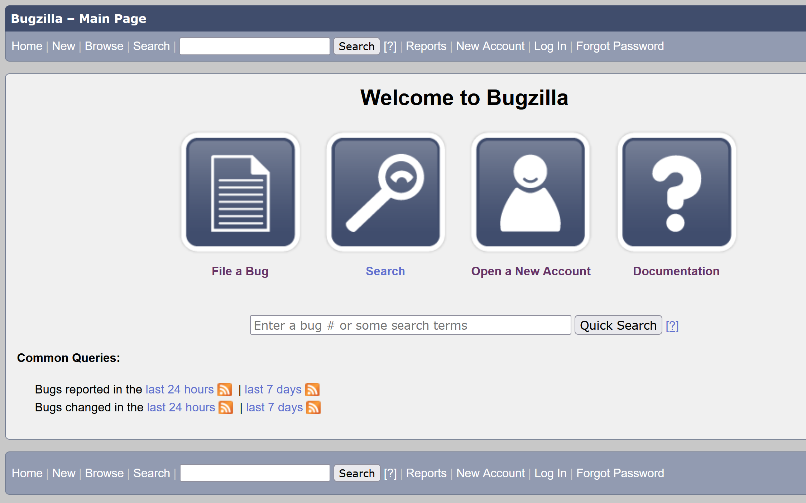
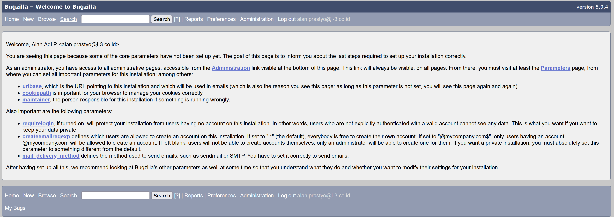

# Install Bugzilla
-----

Install epel-release
```
sudo yum -y install epel-release
```

set permissive selinux
```
sudo setenforce 0
sudo vi /etc/selinux/config
```

Install, configure and start Apache:
```
sudo yum -y install httpd mod_perl mod_ssl

sudo systemctl enable httpd
sudo systemctl start httpd

sudo firewall-cmd --permanent --add-service=http
sudo firewall-cmd --permanent --add-service=https
sudo firewall-cmd --reload
```

Install mariadb
```
sudo yum -y install mariadb-server
sudo vi /etc/my.cnf.d/server.cnf

---
[mysqld]
max_allowed_packet=20M
ft_min_word_len=2
```

Restart mariabd
```
sudo systemctl start mariadb
sudo systemctl enable mariadb
```

Set password
```
sudo mysql -u root
    MariaDB [(none)]> SET PASSWORD FOR 'root'@'localhost' = PASSWORD('rahasiaroot');
    MariaDB [(none)]> \q
mysql -u root -p
    MariaDB [(none)]> CREATE DATABASE bugs;
    MariaDB [(none)]> GRANT ALL ON bugs.* to bugs@localhost IDENTIFIED BY 'rahasia';
    MariaDB [(none)]> FLUSH PRIVILEGES;
    MariaDB [(none)]> \q
```

Download bugzilla
```
cd
wget https://ftp.mozilla.org/pub/mozilla.org/webtools/bugzilla-5.0.4.tar.gz
sudo tar -C /opt -zxvf bugzilla-5.0.4.tar.gz
sudo ln -s /opt/bugzilla-5.0.4 /var/www/html/bugzilla
sudo chown apache:apache /var/www/html/bugzilla
sudo chmod -R 2774 /var/www/html/bugzilla
```

Install perl depdendancy
```
sudo yum install gd gd-devel rst2pdf graphviz patchutils perl perl-CPAN perl-DBD-MySQL -y -y
sudo yum -y install gcc perl*
perl -v
```

set db password
```
vi localconfig
    $db_pass = 'rahasia';
```

Setup bugzilla
```
cd /var/www/html/bugzilla/
sudo  /usr/bin/perl install-module.pl --all
sudo ./checksetup.pl
```

Set user admin
```
Administrator's e-mail address: admin@example.com
Administrator's real name: John Doe
Administrator's password: your-admin-password
```

Set virtualhost bugzilla
```
sudo vi /etc/httpd/conf.d/bugzilla.conf
 ---
 <VirtualHost *:80>
     DocumentRoot /var/www/html/bugzilla/
     ServerName bugzilla.i3datacenter.my.id
 </VirtualHost>

 <Directory /var/www/html/bugzilla>
     AddHandler cgi-script .cgi
     Options +ExecCGI +Indexes
     DirectoryIndex index.cgi
     AllowOverride Authconfig FileInfo Indexes Limit Options
 </Directory>
 ---

sudo systemctl restart httpd
```
Configure selinux
```
sudo yum -y install policycoreutils-python

sudo semanage fcontext -a -t httpd_sys_script_exec_t '/var/www/html/bugzilla(/.*)?/.*\.cgi'
sudo semanage fcontext -a -t httpd_sys_rw_content_t '/var/www/html/bugzilla/data(/.*)?'
sudo restorecon -Rv /var/www/html/bugzilla/
sudo setsebool -P httpd_enable_cgi 1

 (if you want to allow Bugzilla to check for updates)
sudo setsebool -P httpd_can_network_connect 1

 (if you want to use memcache)
sudo setsebool -P httpd_can_network_memcache 1
```

Install and configure memcached (if desired):
```
sudo yum -y install memcached
sudo systemctl start memcached
sudo systemctl enable memcached
```

Verify Bugzilla Server
```
sudo /var/www/html/bugzilla/testserver.pl http://localhost

---output---
TEST-OK Webserver is running under group id in $webservergroup.
TEST-OK Got padlock picture.
TEST-OK Webserver is executing CGIs via mod_perl/2.0.11.
TEST-OK Webserver is preventing fetch of http://localhost/localconfig.
TEST-OK GD version 2.78, libgd version 2.0.34; Major versions match.
TEST-OK GD library generated a good PNG image.
TEST-OK Chart library generated a good PNG image.
TEST-OK Template::Plugin::GD is installed.
```

Access `bugzilla.i3datacenter.my.id`





Refrensi:
- https://www.alibabacloud.com/blog/how-to-install-bugzilla-on-centos-7_594622
- https://www.jdknight.me/docs/sd/devops/setup-bugzilla-centos7.html
- https://www.vultr.com/docs/how-to-install-bugzilla-5-0-x-on-centos-7/