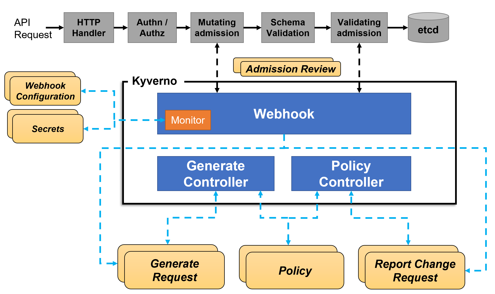

# Installation Kyverno

## About Kyverno
Kyverno (Greek for “govern”) is a policy engine designed specifically for Kubernetes. Some of its many features include:

- policies as Kubernetes resources (no new language to learn!)
- validate, mutate, or generate any resource
- verify container images for software supply chain security
- inspect image metadata
- match resources using label selectors and wildcards
- validate and mutate using overlays (like Kustomize!)
- synchronize configurations across Namespaces
- block non-conformant resources using admission controls, or report policy violations
- test policies and validate resources using the Kyverno CLI, in your CI/CD pipeline, before applying to your cluster
- manage policies as code using familiar tools like git and kustomize

Kyverno allows cluster administrators to manage environment specific configurations independently of workload configurations and enforce configuration best practices for their clusters. Kyverno can be used to scan existing workloads for best practices, or can be used to enforce best practices by blocking or mutating API requests.

## How Kyverno works 

Kyverno runs as a dynamic admission controller in a Kubernetes cluster. Kyverno receives validating and mutating admission webhook HTTP callbacks from the kube-apiserver and applies matching policies to return results that enforce admission policies or reject requests.

Kyverno policies can match resources using the resource kind, name, and label selectors. Wildcards are supported in names.

Mutating policies can be written as overlays (similar to Kustomize) or as a RFC 6902 JSON Patch. Validating policies also use an overlay style syntax, with support for pattern matching and conditional (if-then-else) processing.

Policy enforcement is captured using Kubernetes events. Kyverno also reports policy violations for existing resources.

The picture below shows the high-level architecture for Kyverno:



## Install Kyverno with Helm
```
# Add the Helm repository
helm repo add kyverno https://kyverno.github.io/kyverno/

# Scan your Helm repositories to fetch the latest available charts.
helm repo update

# List Repo
helm repo list

# Install the Kyverno Helm chart into a new namespace called "kyverno"

# Verivy Deloyment
helm list --all-namespaces
```

## Uninstall Kyverno
```
helm uninstall kyverno kyverno/kyverno --namespace kyverno
```

## Apply policy
It contains a single validation rule that requires that all Pods have a app.kubernetes.io/name label

```
kubectl apply -f sample-policy-pod.yaml
```

## Validate Deployment Without label
```
kubectl create deployment nginx --image=nginx
```
Output
```
error: failed to create deployment: admission webhook "validate.kyverno.svc-fail" denied the request: 

resource Deployment/default/nginx was blocked due to the following policies

require-labels:
  autogen-check-for-labels: 'validation error: label ''app.kubernetes.io/name'' is
    required. Rule autogen-check-for-labels failed at path /spec/template/metadata/labels/app.kubernetes.io/name/'
```
Solution: Create Pod with label
```
kubectl run nginx --image nginx --labels app.kubernetes.io/name=nginx
```
Note:
- Kyverno may be configured to exclude system Namespaces like kube-system and kyverno. Make sure you create the Deployment in a user-defined Namespace or the default Namespace. 

## Verify Report
```
» kubectl get policyreport -A --all-namespaces                                                           1 ↵ 
NAMESPACE            NAME                         PASS   FAIL   WARN   ERROR   SKIP   AGE
default              polr-ns-default              0      1      0      0       0      9s
local-path-storage   polr-ns-local-path-storage   0      1      0      0       0      9s
metallb-system       polr-ns-metallb-system       0      2      0      0       0      9s
```

## Install Policy Report UI
```
helm repo add policy-reporter https://kyverno.github.io/policy-reporter
helm repo update
helm install policy-reporter policy-reporter/policy-reporter --set kyvernoPlugin.enabled=true --set ui.enabled=true --set ui.plugins.kyverno=true -n policy-reporter --create-namespace
kubectl port-forward service/policy-reporter-ui 8082:8080 -n policy-reporter
```
Open `http://localhost:8082/` in your browser.

## Install Kyverno CLI
```
brew install kyverno
sudo cp .linuxbrew/Cellar/kyverno/1.7.2/bin/kyverno /bin/
kyvverno version
```

## Study Case - Consider the following policy and resources
Note:
- Audit
- Enforce
```
kyverno apply policy-resources.yaml -r resources1.yaml -r resources2.yaml --policy-report
```

Ref:
- https://kyverno.io/docs/introduction/
- https://github.com/kyverno/policy-reporter#readme