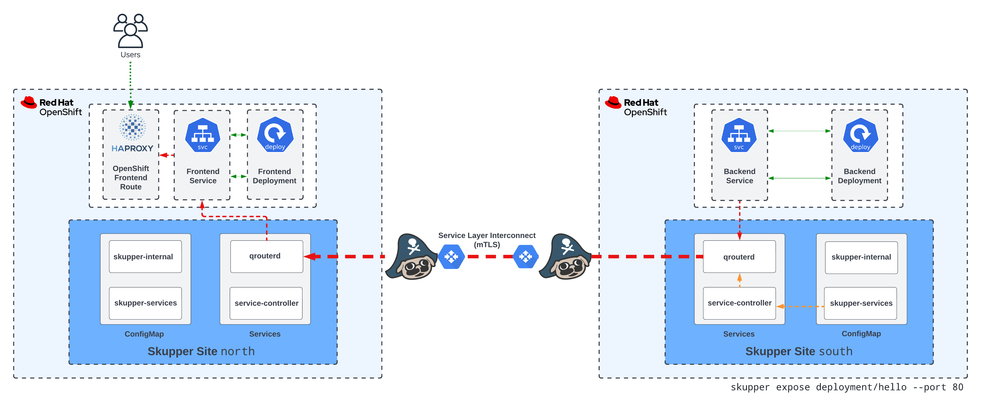
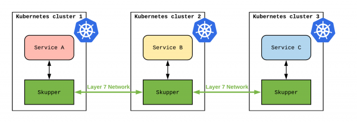
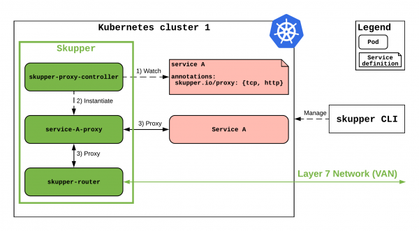
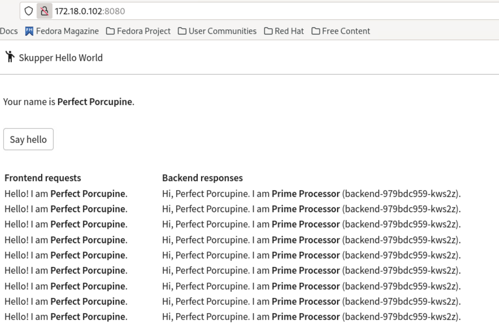

# Belajar Bareng - Skupper Network Multi Cluster Kubernetes

Skupper is a layer 7 service interconnect. It enables secure communication across Kubernetes clusters with no VPNs or special firewall rules. 

With Skupper, your application can span multiple cloud providers, data centers, and regions.


## Installation Kubernetes with Kind
> Install Docker
```
sudo dnf install dnf-plugins-core
udo dnf config-manager --add-repo https://download.docker.com/linux/fedora/docker-ce.repo
sudo dnf install docker-ce docker-ce-cli containerd.io
sudo systemctl start docker
sudo systemctl enable docker
sudo systemctl status docker
sudo docker run hello-world
sudo groupadd docker && sudo gpasswd -a ${USER} docker && sudo systemctl restart docker
sudo usermod -a -G docker alanadiprastyo
```

> Install Kind
```
# For AMD64 / x86_64
[ $(uname -m) = x86_64 ] && curl -Lo ./kind https://kind.sigs.k8s.io/dl/v0.20.0/kind-linux-amd64
chmod +x ./kind
sudo mv ./kind /usr/local/bin/kind
```

> Create Cluster Kubernetes
```
kind create cluster --name kind
kind create cluster --name kind-2
kind create cluster --name kind-3

#get cluster
$ kind get clusters
kind
kind-2
kind-3

#change context

kubectl config use-context  kind-kind
kubectl config use-context  kind-kind-2
kubectl config use-context  kind-kind-3
```


> Install MetalLB as Load Balancer
```
kubectl apply -f https://raw.githubusercontent.com/metallb/metallb/v0.13.7/config/manifests/metallb-native.yaml

kubectl wait --namespace metallb-system \
                --for=condition=ready pod \
                --selector=app=metallb \
                --timeout=90s
```
> Verify network kind
```
docker network inspect -f '{{.IPAM.Config}}' kind
```

> Setting Pool Address for MetalLB
```
kubectl apply -f  kind-add-pool.yaml
kubectl apply -f  kind2-add-pool.yaml
kubectl apply -f  kind3-add-pool.yaml
```
> Overview Skupper Topology 

- Openshift



- Kubernetes



> Skupper Architecture 



> Deploy Skupper
```
curl https://skupper.io/install.sh | sh
```

> Create 3 namespaces
```
# kind-1
kubectl config use-context  kind-kind
kubectl create  ns jakarta

#kind-2
kubectl config use-context  kind-kind-2
kubectl create  ns bandung

#kind-3
kubectl config use-context  kind-kind-3
kubectl create  ns surabaya
```

> Define Router Skupper in Surabaya
```
$ kubectl config use-context  kind-kind-3
$ skupper init --enable-console --enable-flow-collector -n surabaya
Waiting for status...
Skupper status is not loaded yet.
Skupper is now installed in namespace 'surabaya'.  Use 'skupper status' to get more information.

#check status
$ skupper status -n surabaya
Skupper is enabled for namespace "surabaya". It is not connected to any other sites. It has no exposed services.
The site console url is:  https://172.18.0.101:8010
The credentials for internal console-auth mode are held in secret: 'skupper-console-users'

#Get secret admin console
kubectl get secret skupper-console-users -n surabaya -o yaml

#decode base64
echo 'xxyyzz' | base64 -d
```

> Initialize Skupper in Jakarta and Bandung
```
#jakarta
kubectl config use-context  kind-kind
skupper init -n jakarta
skupper status -n jakarta
Skupper is enabled for namespace "jakarta". It is not connected to any other sites. It has no exposed services.

#bandung
kubectl config use-context  kind-kind-2
skupper init -n bandung
skupper status -n bandung
Skupper is enabled for namespace "bandung". It is not connected to any other sites. It has no exposed services.
```

> Generate Link namespaces Surabaya Center Hub to Jakarta and Bandung
```
# Surabaya Center Hub
skupper token create surabaya.token -n surabaya

# Jakarta
skupper link create surabaya.token -n jakarta

# Bandung
skupper link create surabaya.token -n bandung
Site configured to link to https://172.18.0.100:8081/c70bde5c-b7a8-11ee-a39c-0050569a0194 (name=link1)
Check the status of the link using 'skupper link status'.
```

> Deploy Frontend apps on Surabaya
```
kubectl config use-context  kind-kind-3
kubectl create deployment frontend --image quay.io/skupper/hello-world-frontend -n surabaya
```

> Deploy Backend apps on Jakarta
```
kubectl config use-context  kind-kind
kubectl create deployment backend --image quay.io/skupper/hello-world-backend -n jakarta
```

> Expose Backend Services on jakarta
```
skupper expose deployment/backend --port 8080 -n jakarta
```

> Check backend on Surabaya
```
[alanadiprastyo@fedora ~]$ kubectl get svc -n surabaya
NAME                   TYPE           CLUSTER-IP      EXTERNAL-IP    PORT(S)                                          AGE
backend                ClusterIP      10.96.241.218   <none>         8080/TCP                                         22m
```

> Test Application
```
kubectl expose deployment frontend --port 8080 --type LoadBalancer -n surabaya

[alanadiprastyo@fedora ~]$ kubectl get svc -n surabaya
frontend               LoadBalancer   10.96.75.72     172.18.0.102   8080:31203/TCP                                   19m

curl http://172.18.0.102:8080/api/health
```



Ref:
- https://www.wjc.page/2022-04-skupper-deep-dive/
- https://developers.redhat.com/blog/2020/01/01/skupper-io-let-your-services-communicate-across-kubernetes-clusters#skupper_architecture
- https://netprototalk.net/2019/11/12/virtual-application-networks-for-hybrid-cloud-interconnect/
- https://qpid.apache.org/components/dispatch-router/