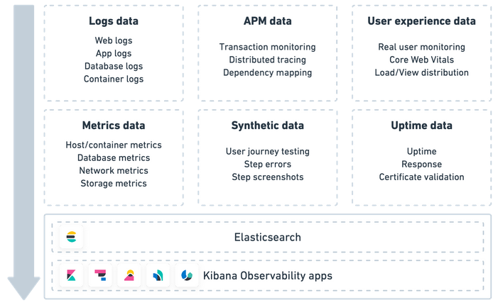
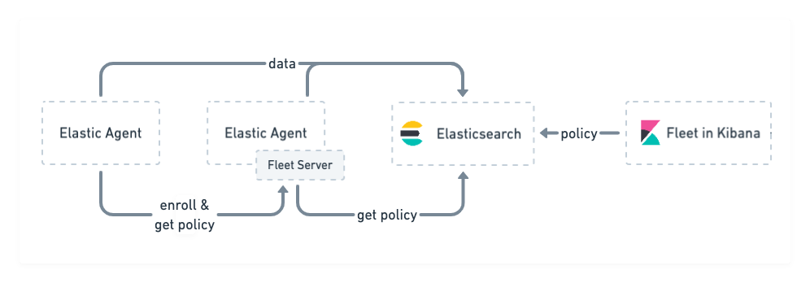
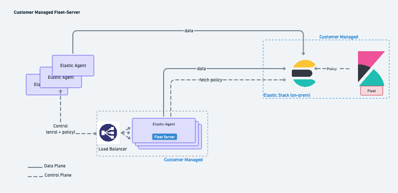

# Belajar Bareng - Observability with Elastic APM

Observability provides you with granular insights and context into the behavior of applications running in your environments. Where Observability have 3 pilars is <b>Metrics, Logs dan Traces</b>

Elastic Observability provides you with a single stack to unify your logs, metrics, uptime data, application traces, user experience data, and synthetics. Ingest your data directly to Elasticsearch, where you can further process and enhance the data, before visualizing it in Kibana.



## Topology 
- 1 Server AIO Elasticsearch + Kibana
- 1 Server Fleet Agent

## Install Elasticsearch
```
vi /etc/yum.repos.d/elasticsearch.repo
```
```
[elasticsearch]
name=Elasticsearch repository for 8.x packages
baseurl=https://artifacts.elastic.co/packages/8.x/yum
gpgcheck=1
gpgkey=https://artifacts.elastic.co/GPG-KEY-elasticsearch
enabled=0
autorefresh=1
type=rpm-md
```
```
sudo systemctl daemon-reload
sudo systemctl enable elasticsearch.service --now
sudo systemctl status elasticsearch.service
```
```
/usr/share/elasticsearch/bin/elasticsearch-reset-password -u elastic -p
```

Test Connection to ElasticSearch

```
curl --cacert /etc/elasticsearch/certs/http_ca.crt -u elastic https://localhost:9200
```
output
```
Enter host password for user 'elastic':
{
  "name" : "dev-laravel",
  "cluster_name" : "elasticsearch",
  "cluster_uuid" : "VSyMpgfWT7mtO70lvPVLwA",
  "version" : {
    "number" : "8.2.0",
    "build_flavor" : "default",
    "build_type" : "rpm",
    "build_hash" : "b174af62e8dd9f4ac4d25875e9381ffe2b9282c5",
    "build_date" : "2022-04-20T10:35:10.180408517Z",
    "build_snapshot" : false,
    "lucene_version" : "9.1.0",
    "minimum_wire_compatibility_version" : "7.17.0",
    "minimum_index_compatibility_version" : "7.0.0"
  },
  "tagline" : "You Know, for Search"
}
```
Ref:
- https://www.elastic.co/guide/en/elastic-stack-get-started/8.2/get-started-elastic-stack.html#install-elasticsearch

## Install Kibana
```
rpm --import https://artifacts.elastic.co/GPG-KEY-elasticsearch
```
```
$ vi /etc/yum.repos.d/kibana.repo
[kibana-8.x]
name=Kibana repository for 8.x packages
baseurl=https://artifacts.elastic.co/packages/8.x/yum
gpgcheck=1
gpgkey=https://artifacts.elastic.co/GPG-KEY-elasticsearch
enabled=1
autorefresh=1
type=rpm-md
```

Install Kibana
```
sudo yum install kibana
```

Generate enrollment token for kibana
```
/usr/share/elasticsearch/bin/elasticsearch-create-enrollment-token -s kibana
```

Enable and Start services
```
sudo systemctl daemon-reload
sudo systemctl enable kibana.service
sudo systemctl start kibana.service
```

Access kibana web console and paste token enrollment for kibana

## Install APM Server

Fleet Server is a component of the Elastic Stack used to centrally manage Elastic Agents


Fleet Server runs as a subprocess inside an Elastic Agent

### Add a Fleet Server
To use Fleet for central management, a Fleet Server must be running and accessible to your hosts.

Fleet Server can be deployed on-premises and managed by the user. In this deployment model, the administrator is responsible for Fleet Server deployment and lifecycle management. This mode of operation is predominantly chosen to satisfy data governance requirements or used in scenarios where the agents only have access to a private segmented network.



Ref: 
- https://www.elastic.co/guide/en/fleet/8.2/add-a-fleet-server.html#fleet-server-compatibility
- https://www.elastic.co/guide/en/apm/guide/8.2/apm-quick-start.html
- https://www.elastic.co/guide/en/observability/current/apm.html