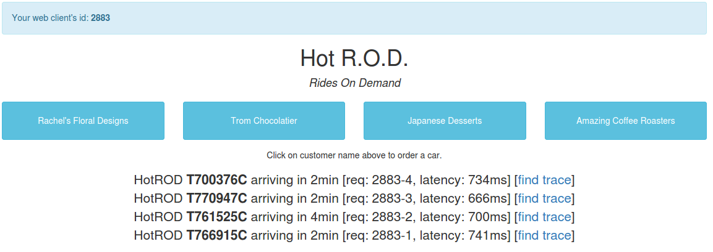
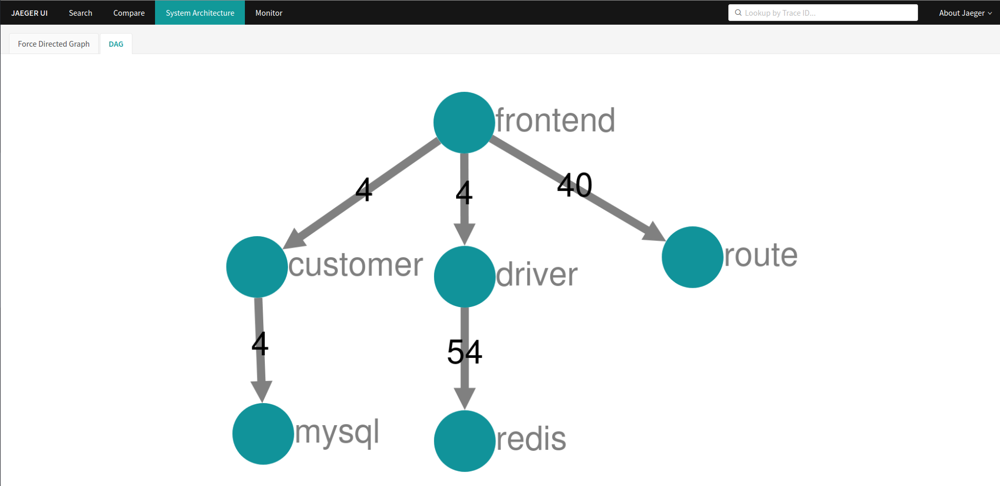

# Belajar Bareng - Observability Part 1 (Jaeger)

## Install Jaeger on Docker

```
docker run -d --name jaeger \
  -e COLLECTOR_ZIPKIN_HOST_PORT=:9411 \
  -p 5775:5775/udp \
  -p 6831:6831/udp \
  -p 6832:6832/udp \
  -p 5778:5778 \
  -p 16686:16686 \
  -p 14250:14250 \
  -p 14268:14268 \
  -p 14269:14269 \
  -p 9411:9411 \
  jaegertracing/all-in-one:1.33
```

Access dashboard information Jaeger
- `http://localhost:16686`

## Install Jaeger on Kubernetes Operator
Before install jaeger operator, you must install  cert-manager
```
kubectl apply -f https://github.com/jetstack/cert-manager/releases/download/v1.6.3/cert-manager.yaml
```

install Jaeger operator
```
kubectl create namespace observability # <1>
kubectl create -f https://github.com/jaegertracing/jaeger-operator/releases/download/v1.33.0/jaeger-operator.yaml -n observability # <2>
kubectl get deployment jaeger-operator -n observability
```

Deploy AIO image
```
apiVersion: jaegertracing.io/v1
kind: Jaeger
metadata:
  name: simplest
```
```
kubectl apply -f simplest.yaml
kubectl get jaegers
kubectl get pods -l app.kubernetes.io/instance=simplest
kubectl logs -l app.kubernetes.io/instance=simplest
```
access Jaeger UI
```
kubectl port-forward pod-name portlaptop:portcontainer
kubectl port-forward simplest-7cbdb6f7c9-h6zhd 16690:16686
```
- `http://localhost:16690`
## Install Sample App: HotROD

```
docker run --rm -it \
  --link jaeger \
  -p8080-8083:8080-8083 \
  -e JAEGER_AGENT_HOST="jaeger" \
  jaegertracing/example-hotrod:1.33 \
  all
```
Access HotROD Apps


Visualization Arch Apps use DAG (Directed Acyclic Graph)


`Test Apps with parallel access to hotrod`

## Jaeger Source Code

Clone repo jaegertracing
```
git clone https://github.com/jaegertracing/jaeger.git
cd jaeger
go mod tidy
go run ./examples/hotrod/main.go help
```

Fix some issue on code
```
```

Build Binary
```
go build -o example-hotrod
```

Ref:
- https://www.jaegertracing.io/docs/1.33/getting-started/
- https://cert-manager.io/v1.6-docs/installation/#default-static-install